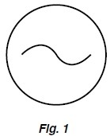

## Visual Symbols and the Blind

Part 1
From a number of recent studies, it has become clear that blind people can appreciate the use of outlines and
perspectives to describe the arrangement of objects and other surfaces in space. But pictures are more than literal
representations. This fact was drawn to my attention dramatically when a blind woman in one of my investigations decided
on her own initiative to draw a wheel as it was spinning. To show this motion, she traced a curve inside the circle (
Fig.1). I was taken aback. Lines of motion, such as the one she used, are a very recent invention in the history of
illustration. Indeed, as art scholar David Kunzle notes, Wilhelm Busch, a trend-setting nineteenth-century cartoonist,
used virtually no motion lines in his popular figures until about 1877.

When I asked several other blind study subjects to draw a spinning wheel, one particularly clever rendition appeared
repeatedly: several subjects showed the wheel’s spokes as curved lines. When asked about these curves, they all
described them as metaphorical ways of suggesting motion. Majority rule would argue that this device somehow indicated
motion very well. But was it a better indicator than, say, broken or wavy lines – or any other kind of line, for that
matter? The answer was not clear. So I decided to test whether various lines of motion were apt ways of showing movement
or if they were merely idiosyncratic marks. Moreover, I wanted to discover whether there were differences in how the
blind and the sighted interpreted lines of motion.

To search out these answers, I created raised-line drawings of five different wheels, depicting spokes with lines that
curved, bent, waved, dashed and extended beyond the perimeter of the wheel. I then asked eighteen blind volunteers to
feel the wheels and assign one of the following motions to each wheel: wobbling, spinning fast, spinning steadily,
jerking or braking. My control group consisted of eighteen sighted undergraduates from the University of Toronto.

All but one of the blind subjects assigned distinctive motions to each wheel. Most guessed that the curved spokes
indicated that the wheel was spinning steadily; the wavy spokes, they thought, suggested that the wheel was wobbling;
and the bent spokes were taken as a sign that the wheel was jerking. Subjects assumed that spokes extending beyond the
wheel’s perimeter signified that the wheel had its brakes on and that dashed spokes indicated the wheel was spinning
quickly.

In addition, the favored description for the sighted was the favored description for the blind in every instance. What
is more, the consensus among the sighted was barely higher than that among the blind. Because motion devices are
unfamiliar to the blind, the task I gave them involved some problem solving. Evidently, however, the blind not only
figured out meanings for each line of motion, but as a group they generally came up with the same meaning at least as
frequently as did sighted subjects.

Part 2
We have found that the blind understand other kinds of visual metaphors as well. One blind woman drew a picture of a
child inside a heart – choosing that symbol, she said, to show that love surrounded the child. With Chang Hong Liu, a
doctoral student from China, I have begun exploring how well blind people understand the symbolism behind shapes such as
hearts that do not directly represent their meaning. We gave a list of twenty pairs of words to sighted subjects and
asked them to pick from each pair the term that best related to a circle and the term that best related to a square. For
example, we asked: What goes with soft? A circle or a square? Which shape goes with hard?

All our subjects deemed the circle soft and the square hard. A full 94% ascribed happy to the circle, instead of sad.
But other pairs revealed less agreement: 79% matched fast to slow and weak to strong, respectively. And only 51% linked
deep to circle and shallow to square. (See Fig.2) When we tested four totally blind volunteers using the same list, we
found that their choices closely resembled those made by the sighted subjects. One man, who had been blind since birth,
scored extremely well. He made only one match differing from the consensus, assigning ‘far’ to square and ‘near’ to
circle. In fact, only a small majority of sighted subjects – 53% – had paired far and near to the opposite partners.
Thus, we concluded that the blind interpret abstract shapes as sighted people do.